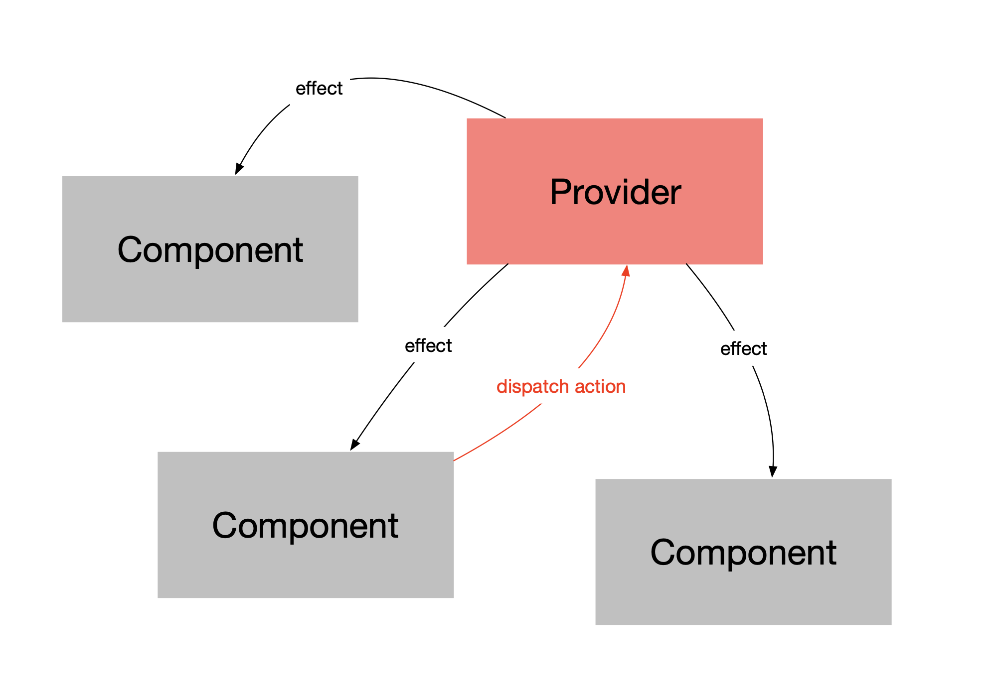

# @phnq/state

[](https://circleci.com/gh/pgostovic/state)

[](https://badge.fury.io/js/%40phnq%2Fstate)

The `@phnq/state` library is a flexible, efficient, easy-to-use **state management** solution for React and React Native applications. Built on top of React's [Context API](https://react.dev/learn/passing-data-deeply-with-context), it provides a great way to isolate an application's business logic from its UI, while at the same time allowing convenient access to it from any component.

## Concepts

Getting a few key ideas down will go a long way towards maximizing the usefulness of `@phnq/state`.

### Providers and Consumers

Similar to React's Context API, `@phnq/state` has providers and consumers. A provider is a component where the state's data is kept; a provider *provides* its services to its descendents in the component tree. A consumer is a React hook that uses some ancestor provider's state.

The consumer/provider relationship is not entirely unlike the client/server relationship. They are similar in the sense that providers/servers are the source of truth, and consumers/clients may access this truth.

A state provider also exposes an API to its consumers; this API is in the form of void-returning functions called `actions`. Action functions are basically one-way messages from the consumer to the provider, instructions on how to affect the state. Resulting state changes trickle down to consumers, triggering renders in the context where they are used.

This one-way data flow pattern is known as `Flux`, and is ubiquitous in React.



## Usage

### Creating a Provider

Creating a state provider involves the following:
1. Defining the state's data schema
2. Defining the actions API interface
3. Setting the initial state
4. Implementing the actions API

Here's a trivial example of a state provider that manages a single value, `accentColor`. It also provides a single action, `setAccentColor`, which updates the accentColor value.

#### theme.ts
```ts
import { createState } from '@phnq/state';

interface State {
  accentColor: string;
}

interface Actions {
  setAccentColor(accentColor: string): void;
}

export default createState<State, Actions>(
  'Theme', // state's name
  {
    accentColor: "blue", // initial state
  },
  ({ setState }) => ({
    setAccentColor(accentColor: string) {
      setState({ accentColor });
    },
  }),
);
```

### Using a Provider

The state provider is a HOC (higher-order component) that wraps the component that needs access to the state.

```tsx
import theme from './theme';
import Box from './Box';

const App = () => (
  <div>
    <h1>My App</h1>
    <Box>I'm in a box!</Box>
  </div>
);

// Wrap the App component with the theme provider.
export default theme.provider(App);
```

Any component that is a descendent of the `App` component can consume the the `theme` state.

The `Box` component is a consumer of the theme state. It's defined in the next section.


### Consuming State

The state's useState() hook is used to access some provider's data and actions. This example takes the `accentColor` value from the theme state and uses it to set the border color of the box.

```tsx
import { ReactNode } from 'react';
import theme from './theme';

const Box = ({ children }: { children: ReactNode }) => {
  const { accentColor } = theme.useState();

  return <div style={{ border: `1px solid ${accentColor}` }}>{children}</div>;
};

export default Box;
```

### Calling Actions

The state's same useState() hook is used to access the provider's actions. This example adds a button that, when clicked, invokes the `setAccentColor` action.

```tsx
import { ReactNode } from 'react';
import theme from './theme';

const Box = ({ children }: { children: ReactNode }) => {
  const { accentColor, setAccentColor } = theme.useState();

  return (
    <div style={{ border: `1px solid ${accentColor}` }}>
      {children}
      <button onClick={() => setAccentColor('red')}>Make red</button>
      <button onClick={() => setAccentColor('green')}>Make green</button>
    </div>
  );
};
```

### Async Side-Effects
Adding `async` behaviour to actions is easy thanks to the one-way (Flux) nature of actions. You just need to add the `async` keyword.

This example uses a pretend function getRandomColor() which returns a color asynchronously.

```ts
import { createState } from '@phnq/state';
import { getRandomColor } from 'some-color-api';

interface State {
  accentColor: string;
}

interface Actions {
  setAccentColor(accentColor: string): void;
  randomizeAccentColor(): void;
}

export default createState<State, Actions>(
  'Theme', // state's name
  {
    accentColor: "blue", // initial state
  },
  ({ setState }) => ({
    setAccentColor(accentColor: string) {
      setState({ accentColor });
    },

    async randomizeAccentColor() {
      setState({ accentColor: await getRandomColor() });
    },
  }),
);
```

## Other Features

### Multiple State Providers

The single/monolithic data store approach used by some popular state management libraries is unnecessarily restrictive. The `@phnq/state` philosophy is to be flexible and allow for multiple state providers. In addition to providing a natural way to make state more modular, it also provides:
- Easier state cleanup - no need to reset things, just need to unmount.
- Multiple instances of the same state - handy for displaying multiple instances of some complicated UI for different data.

### Providers as Consumers
State providers are just components, so since components can be descendents of other components, state providers can be consumers of other state providers.

(examples TBD)

### State Lifecycle Hooks
There are a few implicitly available lifecycle actions:
- init() - called when the state provder is mounted
- destroy() - called when the state provider is unmounted
- onError() - called when an error occurs in an action
- onChange() - called when the state changes
